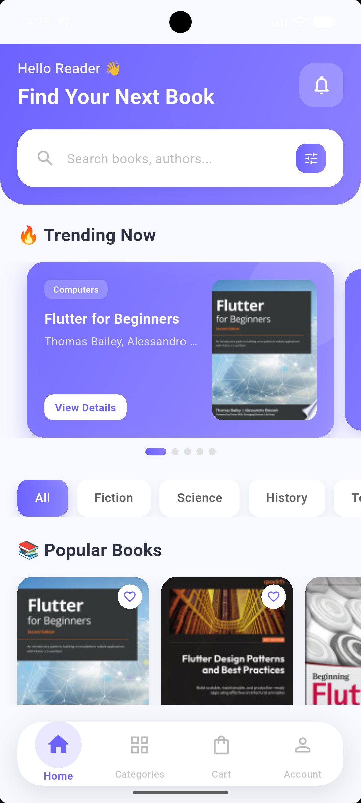
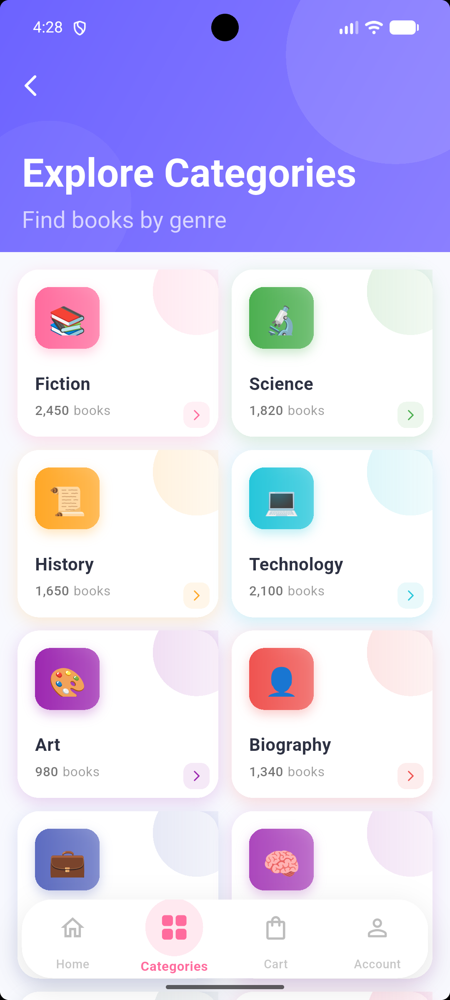
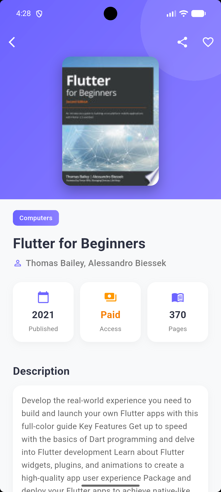
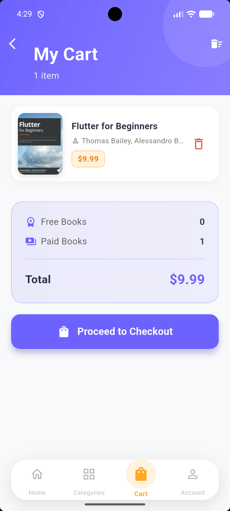
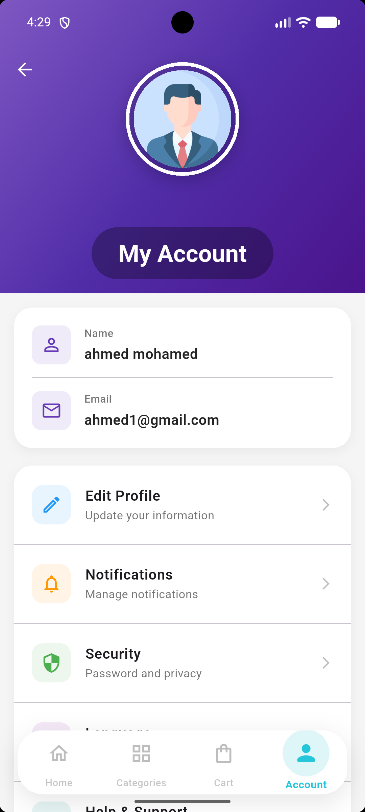
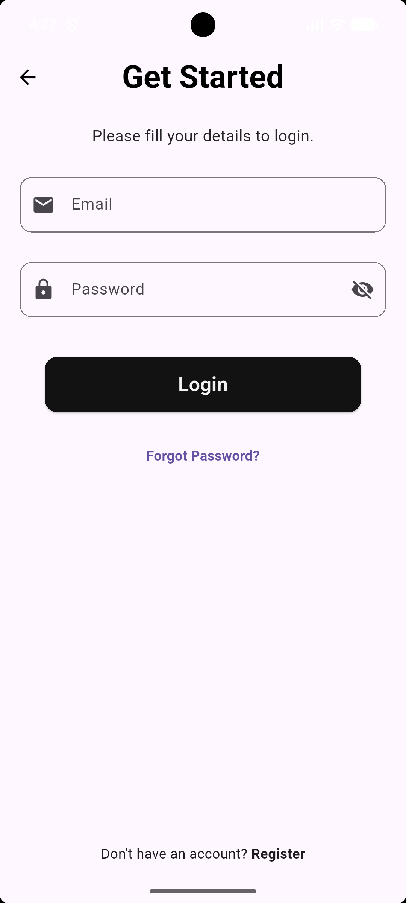

# 📚 Book App

<div align="center">

  
  
  
  

  **A modern, feature-rich Flutter application for browsing, searching, and managing your favorite books.**
  
  [Report Bug](https://github.com/yourusername/book-app/issues) · [Request Feature](https://github.com/yourusername/book-app/issues)
</div>

---

## 📖 Project Overview

**Book App** is a comprehensive e-commerce/library style mobile application built with **Flutter**. It allows users to browse a vast collection of books, view detailed information, manage their cart, and save their favorite reads.

Designed with a focus on **User Experience (UX)** and **Performance**, the app features a sleek, responsive interface, real-time data synchronization with Firebase, and smooth animations. Whether you are a bookworm looking for your next read or a developer exploring robust Flutter architecture, this project serves as a perfect example of a modern mobile app.

---

## ✨ Features

We've packed this app with everything you need:

- **🔐 User Authentication**
  - Secure Sign Up & Login using Firebase Auth.
  - Profile management and Logout functionality.

- **🏠 Home Screen**
  - Featured books and trending collections.
  - Beautiful carousel sliders and banners.

- **📚 Categories**
  - Browse books by genre or category.
  - Intuitive grid layout for easy navigation.

- **🔍 Smart Search**
  - Instantly find books by title, author, or category.
  - Real-time search results.

- **📖 Book Details**
  - Comprehensive book info: Author, Rating, Description, Price.
  - "Add to Cart" and "Buy Now" options.

- **🛒 Shopping Cart**
  - Manage selected books.
  - View total price and proceed to checkout.

- **👤 User Profile**
  - View user details.
  - Manage settings and account preferences.

- **⚡ Advanced Tech**
  - **State Management**: Powered by **GetX** for efficiency and simplicity.
  - **Backend**: **Firebase Firestore** for storing book and user data.
  - **Responsive Design**: Looks great on all screen sizes.

---

## 📸 Screenshots

| **Home Screen** | **Categories** | **Book Details** |
|:---:|:---:|:---:|
|  |  |  |

| **Cart** | **Profile** | **Login/Signup** |
|:---:|:---:|:---:|
|  |  |  |

> *Note: images are placeholders. Please add your screenshots to `assets/screenshots/`.*

---

## 🛠️ Tech Stack & Tools

This project utilizes a powerful stack of technologies:

- **⚡ Flutter**: Google's UI toolkit for building natively compiled applications.
- **💙 Dart**: The programming language behind Flutter.
- **☁️ Firebase**: 
  - **Authentication**: For secure user login.
  - **Cloud Firestore**: NoSQL database for real-time data.
- **🔄 GetX**:
  - **State Management**: Efficient and reactive.
  - **Dependency Injection**: Minimal boilerplate.
  - **Route Management**: Simple and clean navigation.
- **🌐 Dio**: Powerful HTTP client for Dart (if used for external APIs).
- **🎨 UI/UX**: Custom widgets, animations, and responsive layouts.

---

## 🚀 Installation & Getting Started

Follow these steps to run the project locally.

### Prerequisites
- **Flutter SDK**: [Install Flutter](https://flutter.dev/docs/get-started/install)
- **Dart SDK**: Included with Flutter.
- **IDE**: VS Code or Android Studio.
- **Firebase Project**: You need to set up your own Firebase project.

### Steps

1.  **Clone the Repository**
    ```bash
    git clone https://github.com/yourusername/book-app.git
    cd book-app
    ```

2.  **Install Dependencies**
    ```bash
    flutter pub get
    ```

3.  **Setup Firebase**
    *   Create a project on [Firebase Console](https://console.firebase.google.com/).
    *   Add Android/iOS apps to your Firebase project.
    *   Download `google-services.json` (Android) and `GoogleService-Info.plist` (iOS).
    *   Place them in `android/app/` and `ios/Runner/` respectively.
    *   Enable **Authentication** (Email/Password) and **Firestore Database**.

4.  **Run the App**
    ```bash
    flutter run
    ```

---

## 📖 Usage Guide

1.  **Sign Up/Login**: Create an account to access full features.
2.  **Explore**: Use the Home tab to see trending books.
3.  **Search**: Use the search bar to find specific titles.
4.  **Cart**: Add books to your cart and review them before "purchase".
5.  **Profile**: Update your info or logout.

---

## 📞 Contact & Support

Created by **[Your Name]** - feel free to contact me!

- **Email**: [your.email@example.com](mailto:your.email@example.com)
- **GitHub**: [github.com/yourusername](https://github.com/yourusername)
- **LinkedIn**: [linkedin.com/in/yourprofile](https://linkedin.com/in/yourprofile)

If you found this project helpful, please give it a ⭐️!

---
